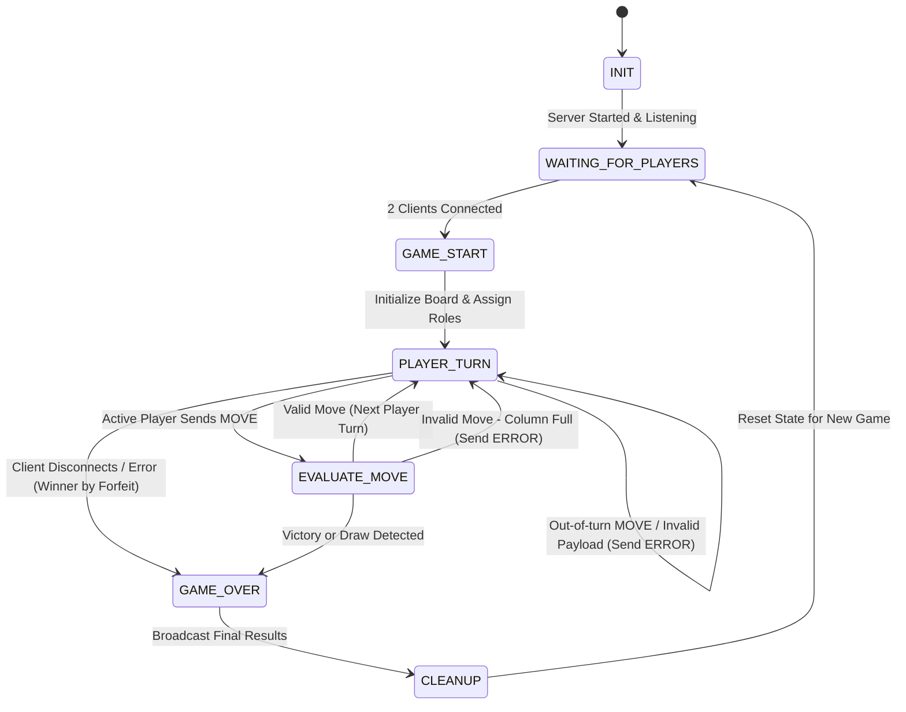

# Game Finite State Machine (FSM) Specification

```mermaid
stateDiagram-v2
    [*] --> INIT
    INIT --> WAITING_FOR_PLAYERS : Server Started & Listening
    WAITING_FOR_PLAYERS --> GAME_START : 2 Clients Connected
    GAME_START --> PLAYER_TURN : Initialize Board & Assign Roles

    PLAYER_TURN --> EVALUATE_MOVE : Active Player Sends MOVE
    PLAYER_TURN --> PLAYER_TURN : Out-of-turn MOVE / Invalid Payload (Send ERROR)
    PLAYER_TURN --> GAME_OVER : Client Disconnects / Error (Winner by Forfeit)

    EVALUATE_MOVE --> PLAYER_TURN : Valid Move (Next Player Turn)
    EVALUATE_MOVE --> PLAYER_TURN : Invalid Move - Column Full (Send ERROR)
    EVALUATE_MOVE --> GAME_OVER : Victory or Draw Detected

    GAME_OVER --> CLEANUP : Broadcast Final Results
    CLEANUP --> WAITING_FOR_PLAYERS : Reset State for New Game
```
